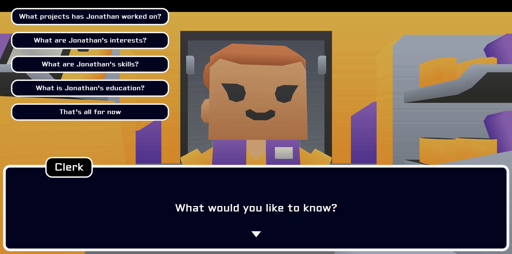

# Jonathan's Project Arcade (Portfolio Website)

Welcome to my project portfolio website disguised as an arcade built using [ThreeJS](https://threejs.org/). This site showcases some of the past projects I have worked on, as well as information about me.

Move in front of the arcade machines and press E (or tap it on mobile) to see my past projects. If you want to learn more about me, go up to the clerk and press E (or again tap) next to the clerk to read about me!

[Click here](https://portfolio-arcade-flame.vercel.app/) to enter the arcade now!

## Preview
#### Arcade Interior

#### Dialogue Menu

## Tech Stack
- ThreeJS - 3D rendering library
- Vite - Development Tool
- GLTFLoader - For loading .gltf 3D models
- HTML, CSS, JavaScript

## Credits & Attributions
**Music**
- **"Artistry"** by Ian Taylor

**3D Models**
- **"Mini Arcade"** by KennyNL

    Source: [KenneyNL](https://kenney.nl/assets/mini-arcade)

**Images**
- **"Just a Retro Arcade."** by Cronos

    Source: [Pixel Joint](https://pixeljoint.com/pixelart/149356.htm)

**Fonts**
- **"Pixelify Sans"** by Stefie Justprince

    Source: [Google Fonts](https://fonts.google.com/specimen/Pixelify+Sans)

- **"ByteBounce"** by HipFonts

    Source: [1001Fonts](https://www.1001fonts.com/bytebounce-font.html)

